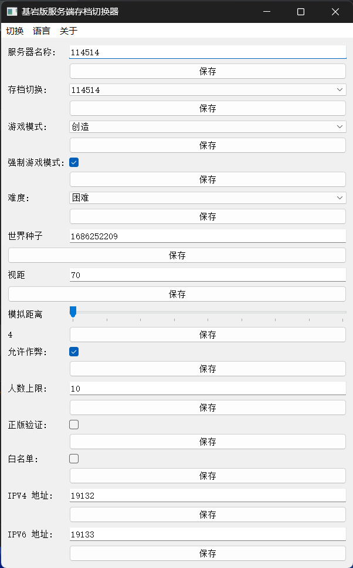

# BDS-World-Selector
用于快速切换 Minecraft 基岩版服务端存档工具，使用 Python 编写

## 介绍

<!-- Improved compatibility of back to top link: See: https://github.com/othneildrew/Best-README-Template/pull/73 -->
<a id="readme-top"></a>
<!--
*** Thanks for checking out the Best-README-Template. If you have a suggestion
*** that would make this better, please fork the repo and create a pull request
*** or simply open an issue with the tag "enhancement".
*** Don't forget to give the project a star!
*** Thanks again! Now go create something AMAZING! :D
-->


<!-- PROJECT SHIELDS -->
<!--
*** I'm using markdown "reference style" links for readability.
*** Reference links are enclosed in brackets [ ] instead of parentheses ( ).
*** See the bottom of this document for the declaration of the reference variables
*** for contributors-url, forks-url, etc. This is an optional, concise syntax you may use.
*** https://www.markdownguide.org/basic-syntax/#reference-style-links
-->
[![贡献者][contributors-shield]][contributors-url]
[![议题][issues-shield]][issues-url]
[![拉取请求][pull-requests-shield]][pull-requests-url]
[![复刻][forks-shield]][forks-url]
[![标星者][stars-shield]][stars-url]
[![许可证][license-shield]](LICENSE)


<!-- PROJECT LOGO -->
<br />
<div align="center">
  <a href="https://github.com/othneildrew/Best-README-Template">
    
  </a>

  <h3 align="center">BDS-World-Selector</h3>

  <p align="center">
    一键修改 Minecraft 基岩版服务端(BDS)配置文件，不再为修改配置坐牢！理论上支持 Ubuntu！
    <!--
    <br />
    <a href="https://github.com/othneildrew/Best-README-Template"><strong>Explore the docs »</strong></a>
    <br />
    -->
    <br />
    <a href="https://github.com/othneildrew/Best-README-Template">View Demo</a>
    ·
    <a href="https://github.com/TC999/BDS-World-Selector/issues">反馈 BUG</a>
    ·
    <a href="https://github.com/TC999/BDS-World-Selector/issues">功能请求</a>
  </p>
</div>


<!-- TABLE OF CONTENTS -->
<details>
  <summary>目录</summary>
  <ol>
    <li>
      <a href="#关于此项目">关于此项目</a>
      <!--ul>
        <li><a href="#built-with">Built With</a></li>
      </ul>
      -->
    </li>
    <li>
      <a href="#快速开始">快速开始</a>
      <!---
      <ul>
        <li><a href="#prerequisites">Prerequisites</a></li>
        <li><a href="#installation">Installation</a></li>
      </ul>
      -->
    </li>
    <!---
    <li><a href="#usage">Usage</a></li>
    <li><a href="#roadmap">Roadmap</a></li>
    -->
    <li><a href="#贡献">贡献</a></li>
    <li><a href="#许可证">许可证</a></li>
    <!---
    <li><a href="#contact">Contact</a></li>
    <li><a href="#acknowledgments">Acknowledgments</a></li>
    -->
  </ol>
</details>


<!-- ABOUT THE PROJECT -->
## 关于此项目
这是一个用于可视化更改 BDS 配置文件的程序，用于快速切换存档，支持多存档不同设置，不再一个个手打配置！
本项目采用 ChatGPT4o 编写，代码质量一般，如有可优化空间，请直接提交拉取请求！如有 BUG ，请直接提交[议题][issues-url]！

- 当前已实现更改：
    - [x] 服务器名
    - [x] 切换存档（下拉框选择）
    - [x] 游戏模式（下拉框选择）
    - [x] 强制游戏模式（勾选框）
    - [x] 种子手动切换（暂不支持读取）
    - [x] 最大在线人数
    - [x] 游戏难度（下拉框选择）
    - [x] 正版验证
    - [x] 白名单启用
    - [x] 视距调整
    - [x] 模拟距离调整（滑块）
    - [x] 玩家权限

## 软件界面截图


## 快速开始
暂无打算发布二进制文件，请使用源码运行

1. 安装 [Python](https://www.python.org)

2. git 克隆仓库到本地或直接下载 ZIP 压缩包
```
https://github.com/TC999/BDS-World-Selector.git
```

3. 将仓库内的`main.py`文件拷贝到您的 BDS 服务端目录下

4. 安装依赖
```python
pip install PyQt5
```

5. 运行 `main.py`

## 贡献
<!---
> [!IMPORTANT]
> 请提前设置GPG密钥，具体操作请查看[Github官方文档][github-doc-gpg-url]
-->
1. 复刻`(Fork)`此仓库
2. 创建一个分支`(Branch)`并以你修改的功能命名
3. 将代码拉到本地修改并提交`(Commit)`
4. 创建一个拉取请求`(Pull Request)`

## ✔ 待办(TODO)
如果做了请直接提交 PR
- [ ] 更多选项
- [ ] 隐藏选项（详见 [Minebbs](https://www.minebbs.com/threads/bedrock-dedicated-server-server-properties.1664/)）
- [ ] 多语言适配（暂时只支持简体中文）
- [ ] 代码优化（GPT写的屎山）
- [ ] 代码分成几个文件（现在`main.py`已经有**500行**代码了）
- [ ] 每个存档单独配置文件（当前实现想法是在每个存档目录下都放一份`server.properties`文件）
- [ ] 种子自动读取(读取存档`level.dat`文件)
- [ ] 界面布局优化（GPT 写的……）
- [ ] 深色模式（使用第三方库实现）

<!--
## 已知 BUG（打勾为已修复）
- [x] 端口更改不可用(无法读取，且会导致程序直接退出)
-->

## 本项目使用
- [PyQt5][PyQt5] - 程序框架
- [Best-README-Template][Best-README-Template] - 自述文件(README)模板

## 许可证
本项目采用 [GPL-3.0 许可证](LICENSE)。

[contributors-url]: https://github.com/TC999/BDS-World-Selector/graphs/contributors "贡献者"
[contributors-shield]: https://img.shields.io/github/contributors/TC999/BDS-World-Selector?style=flat&logoSize=auto&label=%E8%B4%A1%E7%8C%AE%E8%80%85

[issues-url]: https://github.com/TC999/BDS-World-Selector/issues "议题"
[issues-shield]: https://img.shields.io/github/issues/TC999/BDS-World-Selector?style=flat&logoSize=auto&label=%E8%AE%AE%E9%A2%98

[pull-requests-url]: https://github.com/TC999/BDS-World-Selector/pulls "拉取请求"
[pull-requests-shield]: https://img.shields.io/github/issues-pr/TC999/BDS-World-Selector?label=%E6%8B%89%E5%8F%96%E8%AF%B7%E6%B1%82

[forks-url]: https://github.com/TC999/BDS-World-Selector/fork "复刻"
[forks-shield]: https://img.shields.io/github/forks/TC999/BDS-World-Selector?style=flat&label=%E5%A4%8D%E5%88%BB%E6%95%B0

[stars-url]: https://github.com/TC999/BDS-World-Selector/stargazers "星标"
[stars-shield]:https://img.shields.io/github/stars/TC999/BDS-World-Selector?style=flat&logo=github&logoSize=auto&label=%E6%98%9F%E6%A0%87

[license-shield]: https://img.shields.io/github/license/TC999/BDS-World-Selector?style=flat&logoSize=auto&label=%E8%AE%B8%E5%8F%AF%E8%AF%81

[PyQt5]: https://pypi.org/project/PyQt5

[Best-README-Template]: https://github.com/othneildrew/Best-README-Template
